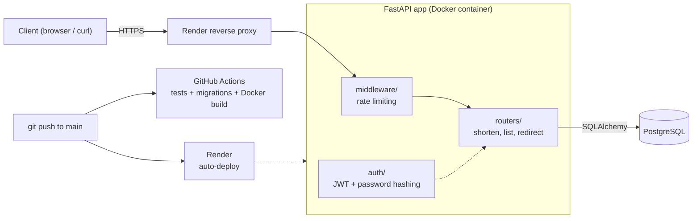

# URL Shortener API

A containerized URL shortener with user accounts, JWT authentication, rate limiting, automated tests, CI, and a live deployment. Built with FastAPI and PostgreSQL.

**Live demo:** https://url-shortener-imtx.onrender.com (opens the interactive API docs)

> The demo runs on a free hosting tier. If it has been idle, the first request can take about a minute while the service wakes up. The free database is also temporary, so accounts and links may be reset.

## What it does

- Register and log in with email and password (passwords are hashed with Argon2, never stored in plain text)
- Create short links while logged in, using a JWT bearer token
- List only your own links (users cannot see each other's links)
- Follow a short link to be redirected to the original URL (public, no login needed)
- Rate limiting, with a stricter limit on the login endpoint to slow down password guessing

## Tech stack

| Area | Tools |
|---|---|
| API | FastAPI, Pydantic |
| Database | PostgreSQL, SQLAlchemy, Alembic migrations |
| Auth | JWT (PyJWT), Argon2 password hashing |
| Packaging | uv |
| Testing | pytest (against a real PostgreSQL database) |
| Containers | Docker, Docker Compose |
| CI | GitHub Actions |
| Hosting | Render (Blueprint via `render.yaml`) |

## Architecture



Every request passes through the rate-limiting middleware first. Protected endpoints then check the JWT through a dependency in `auth/`. Data lives in PostgreSQL, and the schema is managed with Alembic migrations that run automatically when the container starts.

### Project structure

```
url-shortener/
├── app/
│   ├── main.py             # app setup, middleware, routers
│   ├── config.py           # settings from environment variables
│   ├── database.py         # engine and session
│   ├── models.py           # User and Url tables
│   ├── schemas.py          # request/response validation
│   ├── auth/               # register, login, JWT, password hashing
│   ├── middleware/         # rate limiting
│   ├── routers/            # URL endpoints
│   └── services/           # slug generation
├── alembic/                # database migrations
├── tests/                  # pytest suite
├── .github/workflows/      # CI pipeline
├── Dockerfile
├── docker-compose.yml      # app + PostgreSQL for local use
├── render.yaml             # Render Blueprint (deployment)
└── pyproject.toml / uv.lock
```

## API endpoints

| Method | Path | Description | Login required |
|---|---|---|---|
| POST | `/auth/register` | Create an account | No |
| POST | `/auth/login` | Get a JWT access token | No |
| POST | `/urls` | Create a short link | Yes |
| GET | `/urls` | List your own links | Yes |
| GET | `/{slug}` | Redirect to the original URL | No |
| GET | `/health` | Health check | No |

Full interactive documentation is available at `/docs` on the live demo.

### Try it on the live demo

1. Open the [live demo](https://url-shortener-imtx.onrender.com) (it redirects to `/docs`).
2. Use **POST /auth/register** to create an account.
3. Click **Authorize** and log in with your email as the username.
4. Use **POST /urls** with `{"original_url": "https://www.wikipedia.org"}`.
5. Open the returned `short_url` in a new tab.

## Run it locally

**Prerequisites:** Git, Docker Desktop, and [uv](https://docs.astral.sh/uv/) (only needed for running tests or running the app outside Docker).

```bash
git clone https://github.com/stopstressingmeout/url-shortener.git
cd url-shortener
```

Create your settings file and set a secret key:

```bash
# Mac / Linux
cp .env.example .env
# Windows (Command Prompt)
copy .env.example .env
```

Generate a random secret and paste it into `.env` as `SECRET_KEY`:

```bash
uv run python -c "import secrets; print(secrets.token_hex(32))"
```

Start everything (app + PostgreSQL). Migrations run automatically:

```bash
docker compose up --build -d
```

Then open http://localhost:8000/docs. Stop with `docker compose down` (add `-v` to also delete the database data).

### Run the app outside Docker (faster for development)

```bash
docker compose up -d db          # start only PostgreSQL
uv sync                          # install dependencies
uv run alembic upgrade head      # create the tables
uv run fastapi dev app/main.py   # start with auto-reload
```

## Run the tests

With the database container running (`docker compose up -d db`):

```bash
uv run pytest -v
```

The tests use a separate `urlshortener_test` database, which is created automatically, so your development data is never touched. They cover registration, login, token checks, link creation, redirects, ownership isolation between users, and rate limiting.

## Continuous integration

On every push to `main` and on every pull request, GitHub Actions:

1. Starts a PostgreSQL service container
2. Installs dependencies from the lockfile (`uv sync --locked`)
3. Applies the Alembic migrations to an empty database
4. Runs the full pytest suite
5. Builds the Docker image

## Deployment

The app is deployed on [Render](https://render.com) using the Blueprint in `render.yaml`, which defines a Docker web service and a PostgreSQL database.

To deploy your own copy:

1. Fork or push this repository to your GitHub account.
2. Create a Render account and click **New +**, then **Blueprint**.
3. Select the repository and apply the Blueprint. Render builds the Dockerfile, creates the database, and generates a random `SECRET_KEY`.
4. When the service is **Live**, open `https://<your-service>.onrender.com/docs`.

How it fits together:

- Render provides the port in the `PORT` variable, and the container listens on it.
- `DATABASE_URL` is injected from the managed database. The app rewrites `postgres://` / `postgresql://` URLs to use the `psycopg` driver.
- The server runs with proxy headers enabled so generated short links use `https`.
- `alembic upgrade head` runs on every start, so a new database builds its own schema.
- Pushes to `main` redeploy automatically.

## Configuration

| Variable | Purpose | Default |
|---|---|---|
| `DATABASE_URL` | PostgreSQL connection string | required |
| `SECRET_KEY` | Key used to sign JWTs | required |
| `ACCESS_TOKEN_EXPIRE_MINUTES` | Token lifetime | `30` |
| `RATE_LIMIT_REQUESTS` | Requests allowed per window | `60` |
| `RATE_LIMIT_WINDOW_SECONDS` | Window length | `60` |
| `LOGIN_RATE_LIMIT_REQUESTS` | Login attempts allowed per window | `5` |

Locally, Docker Compose also reads `POSTGRES_USER`, `POSTGRES_PASSWORD`, and `POSTGRES_DB` from `.env`. Real secrets are never committed; `.env` is gitignored and `.env.example` documents the settings.

## Design decisions

- **Real PostgreSQL everywhere** (local, tests, CI, production) so behavior matches production.
- **Migrations instead of auto-creating tables**, so schema changes are versioned and reviewable.
- **307 redirects** rather than 301, because browsers cache permanent redirects, which would break future click analytics.
- **Random slugs from the `secrets` module** with collision retry, backed by a unique database constraint.
- **Same error message for unknown email and wrong password**, so attackers cannot discover which emails have accounts.
- **Authorization in the query**: link listings filter by the logged-in user's ID.

## Known limitations

- **Rate limiting is in memory and per process.** It resets on restart and would not be shared across multiple instances. A shared store such as Redis is the production approach.
- **IP-based limits are imperfect**: users behind one network share a limit, and the app currently trusts forwarded-IP headers from the hosting proxy.
- **Free hosting trade-offs**: the service sleeps when idle, and the free database is temporary.
- Tests build tables from the models rather than running the Alembic migrations (CI separately verifies that migrations apply to an empty database).

## Roadmap

- Custom slugs
- Click analytics per link
- QR code generation
- Redis-backed rate limiting
- Linting (ruff) and test coverage reporting in CI
